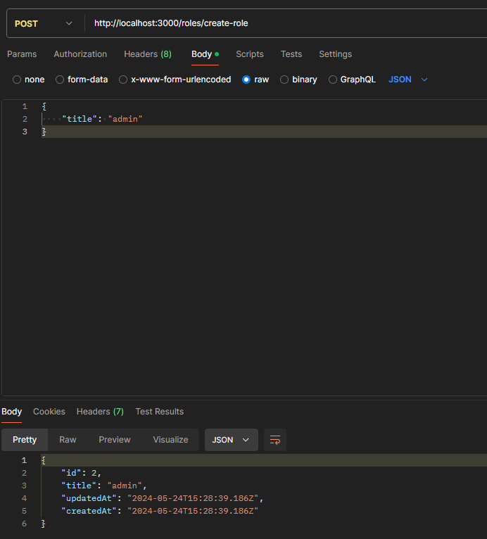
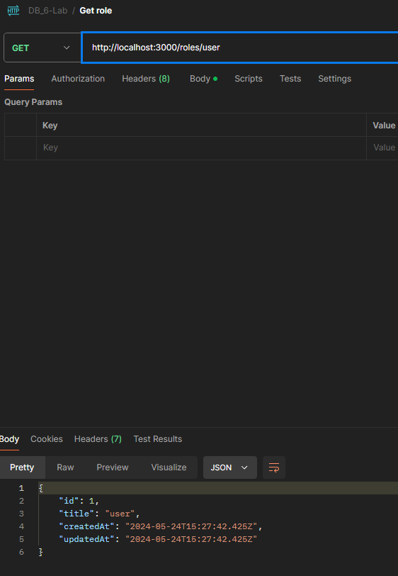
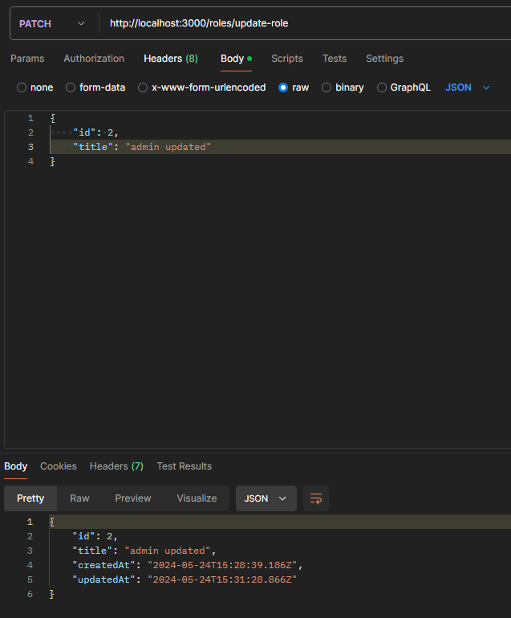
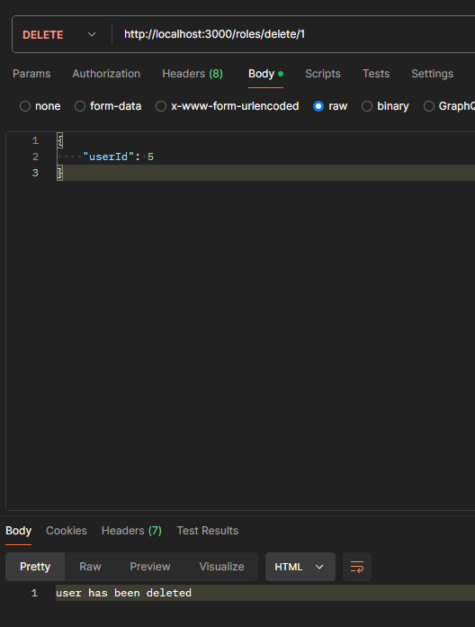
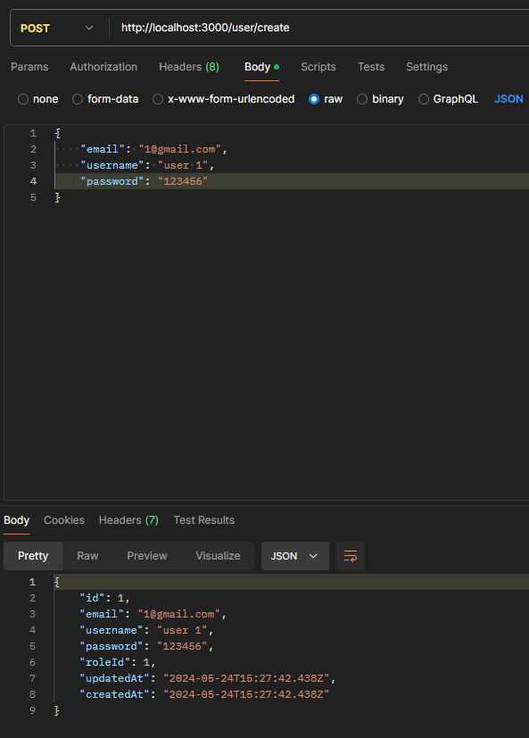
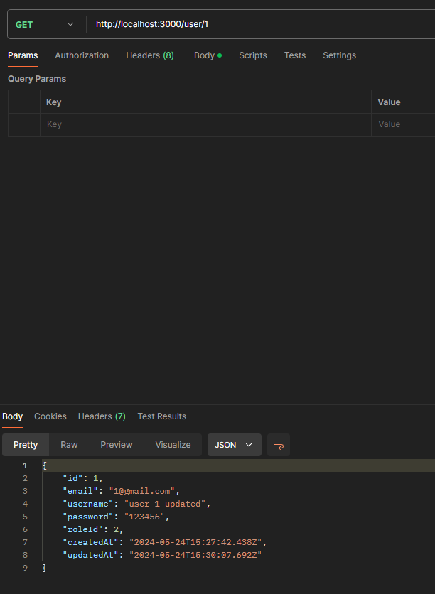
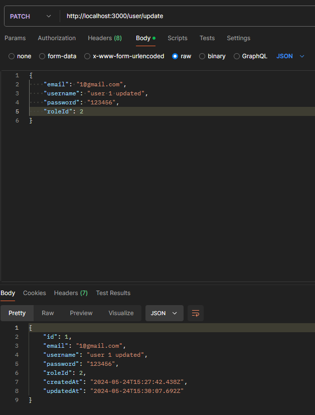
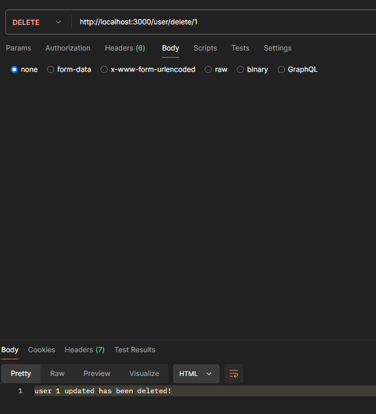

# Тестування працездатності системи

## Role

### POST (Стоврення ролі)

### GET (Отримання даних ролі)

### PATCH (Оновлення ролі)

### DELETE (Видалення ролі)

## User

### POST (Стоврення користувача)

### GET (Отримання даних користувача)

### PATCH (Оновлення даних користувача)

### DELETE (Видалення користувача)
